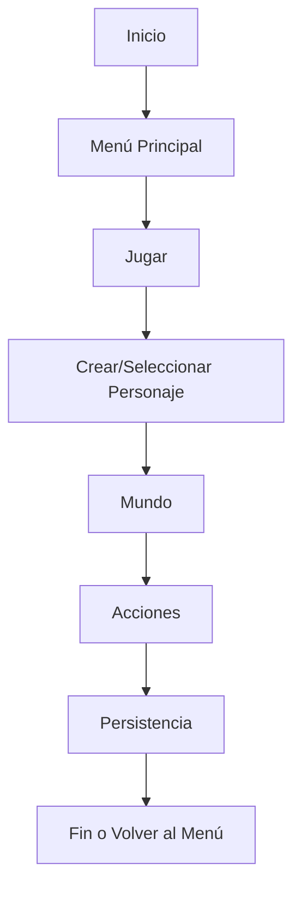

# ProjectG CLI RPG

Proyecto de juego RPG ejecutable por línea de comandos, desarrollado en Deno.

## Instalación

```sh
deno run --allow-read --allow-write main.ts
```

## Estructura

- `main.ts`: Entrada principal del juego.
- `core/`: Módulos base del juego.
  - `personaje.ts`
  - `acciones.ts`
  - `mundo.ts`
  - `db.ts`
  - `menu.ts`
- `mi_base_de_datos.db`: Base de datos local.
- `docs/`: Documentación adicional.

## Diagrama de flujo principal



## Patrones y arquitectura recomendados

- SRP (Single Responsibility Principle)
- Factory
- Command
- Inyección de dependencias
- Persistencia desacoplada
- Tipado estricto
- Ciclo de juego controlado
- Testing modular

## Créditos

Desarrollado por el equipo ProjectG.
